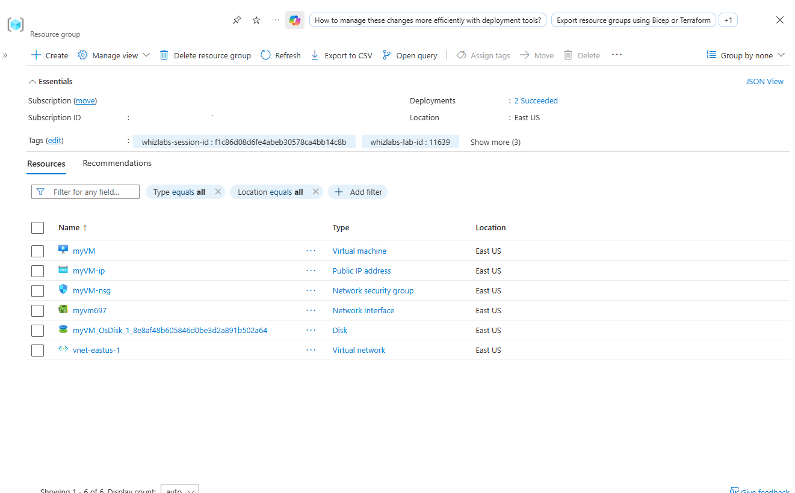
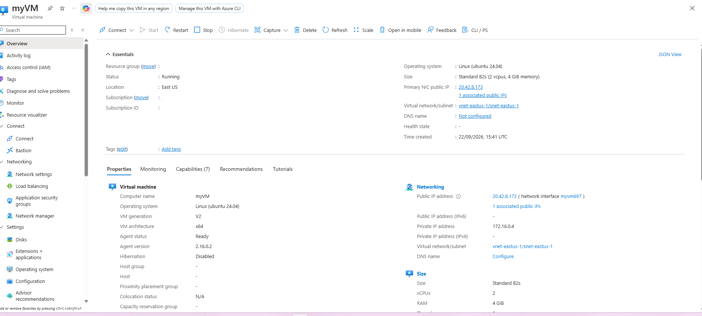
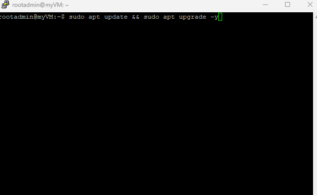
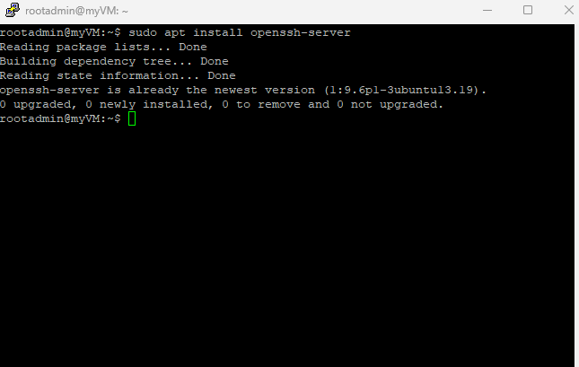
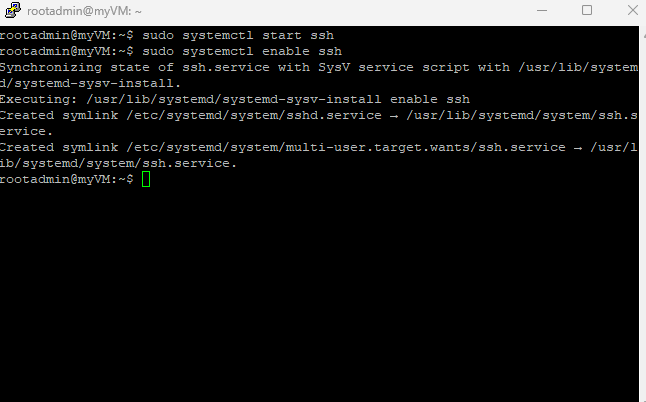
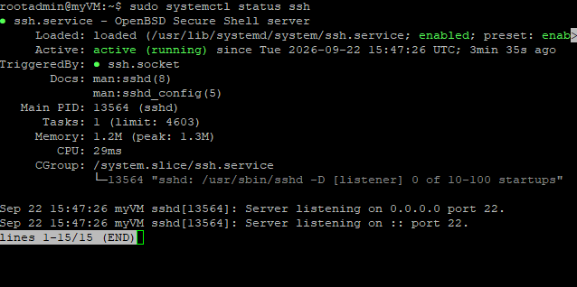
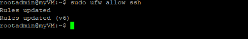
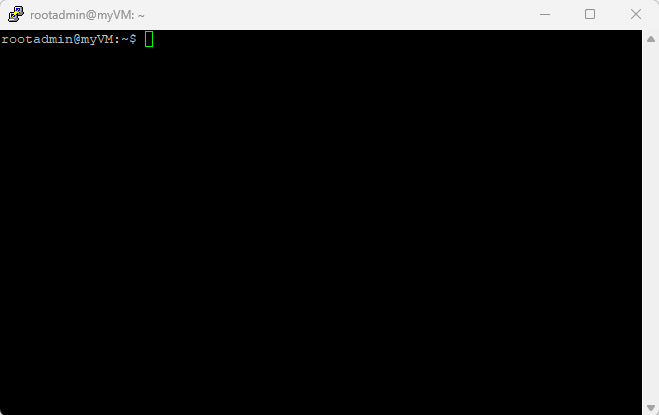
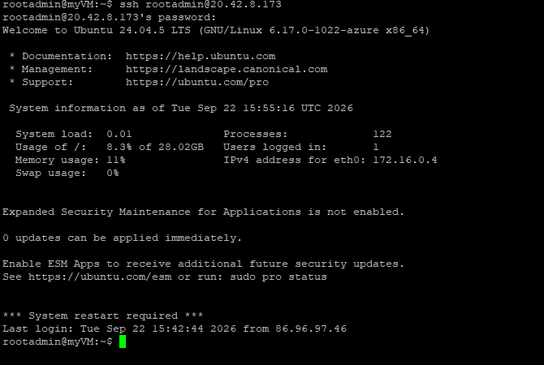

# Installing and Configuring an OpenSSH Server on Ubuntu Linux

A hands-on cloud and Linux systems administration project demonstrating how to provision an Ubuntu 24.04 LTS instance on Microsoft Azure, install and manage the OpenSSH daemon, configure firewall access, and establish secure remote terminal sessions.

---

## 📌 Project Overview & Architecture

* **Cloud Provider:** Microsoft Azure
* **Operating System:** Ubuntu 24.04 LTS (`myVM`)
* **Hardware Specs:** Standard B2s (2 vCPUs, 4 GiB RAM)
* **Networking:** 
  * Virtual Network: `vnet-eastus-1` (`172.16.0.0/16`)
  * Subnet: `snet-eastus-1` (`172.16.0.0/24`)
  * Public IP: `20.42.8.173`
  * Private IP: `172.16.0.4`
* **Security:** Network Security Group (`myVM-nsg`) allowing inbound traffic on Port 22 (SSH) and Port 80 (HTTP).

---

## ⚙️ Step-by-Step Implementation

### Step 1: Azure Infrastructure Deployment

The virtual machine and supporting network resources were provisioned using an Azure Resource Manager (ARM) template:

---

### Step 2: System Package Updates

Connected to the instance and updated local repositories and system packages to their latest versions:

Step 3: Install OpenSSH Server
Installed the openssh-server package using the APT package manager:

Step 4: Service Management (Start & Enable)
Started the SSH service and configured systemd to automatically launch the daemon on system boot:

Step 5: Service Status Verification
Verified that the SSH daemon is active, running, and listening on Port 22:

Step 6: Host Firewall Configuration (UFW)
Configured the Uncomplicated Firewall (UFW) to allow incoming traffic on the default SSH port:

Step 7: Remote Client Connection & Verification
Established a remote connection from the local machine using PuTTY:

Validated end-to-end SSH access directly via terminal to rootadmin@20.42.8.173:

